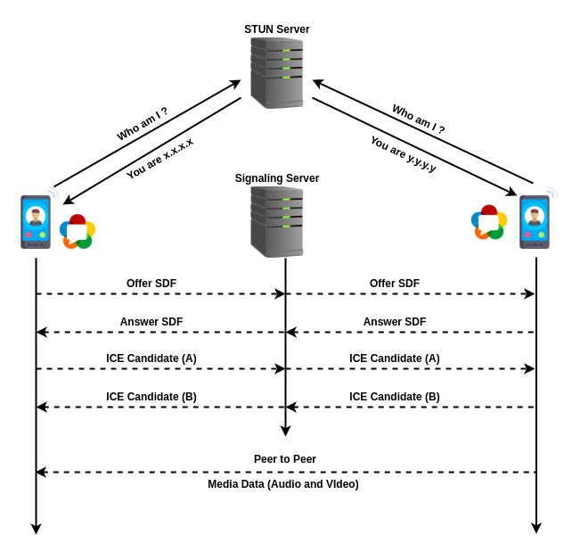

# MirageCall
## Firebase + WebRTC = One-One Video Audio Call

for inital setup of firebase.
```
firebase init hosting
```
to run in local system

```
firebase serve --only hosting
```
to deploy your app in firebase
```
firebase deploy --only hosting
```

This application will be written in html, css, js.

